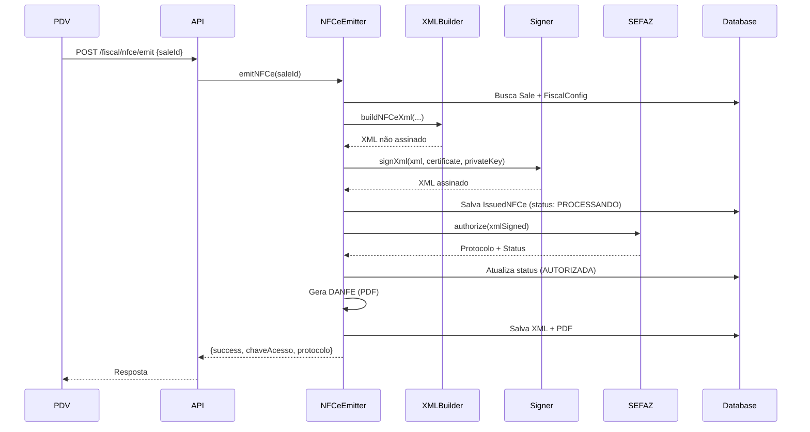

# Arquitetura Técnica - Sistema de Emissão de NFC-e

## 📚 Visão Geral

Sistema completo de emissão de NFC-e (Nota Fiscal de Consumidor Eletrônica) integrado ao PDV, seguindo as especificações técnicas da SEFAZ versão 4.00.

---

## 🏗️ Arquitetura

### Stack Tecnológica

**Backend:**
- Node.js + Express + TypeScript
- Prisma ORM + PostgreSQL
- node-forge (assinatura digital)
- soap (comunicação SEFAZ)
- pdfkit (geração de DANFE)
- qrcode (QR Code da NFC-e)
- xml2js, xmlbuilder2 (manipulação XML)

**Frontend:**
- React + TypeScript + Vite
- TailwindCSS
- Axios

---

## 📁 Estrutura de Arquivos

### Backend

```
backend/src/
├── services/fiscal/
│   ├── encryption.service.ts        # Criptografia AES-256-GCM para dados sensíveis
│   ├── certificate.service.ts       # Gerenciamento de certificados A1/A3
│   ├── xml-signer.service.ts        # Assinatura digital XML (XML-DSig)
│   ├── fiscal-utils.service.ts      # Utilitários (chave acesso, validações)
│   ├── nfce-builder.service.ts      # Geração XML NFC-e (layout 4.00)
│   ├── sefaz-client.service.ts      # Cliente web services SEFAZ
│   ├── danfe.service.ts             # Geração PDF (DANFE)
│   └── nfce-emitter.service.ts      # Orquestrador principal
├── routes/
│   └── fiscal.routes.ts             # Endpoints de API
└── prisma/
    └── schema.prisma                # Modelos de dados (FiscalConfig, IssuedNFCe, etc)
```

### Frontend

```
frontend/src/
├── services/
│   └── fiscal.service.ts            # Cliente API fiscal
└── pages/management/
    └── FiscalConfig.tsx             # Página de configuração
```

---

## 🗄️ Modelo de Dados

### FiscalConfig

Armazena configuração fiscal da empresa.

```prisma
model FiscalConfig {
  // Identificação
  cnpj                String   @unique
  razaoSocial         String
  nomeFantasia        String
  inscricaoEstadual   String

  // Endereço completo
  logradouro, numero, bairro, cep, uf, ...

  // Configurações NFC-e
  serie               Int      @default(1)
  ultimoNumero        Int      @default(0)  // Auto-incrementa
  ambiente            String   // "homologacao" ou "producao"

  // CSC (criptografado)
  cscId               String?
  cscToken            String?  // Encrypted

  // Certificado (criptografado)
  certificateType     String   @default("A3")
  certificatePin      String?  // Encrypted
  certificateA1       String?  // Base64 .pfx
  certificateA1Pass   String?  // Encrypted

  // Relações
  nfces               IssuedNFCe[]
}
```

### IssuedNFCe

Armazena NFC-es emitidas.

```prisma
model IssuedNFCe {
  // Identificação
  numero              Int
  serie               Int
  chaveAcesso         String   @unique  // 44 dígitos

  // Venda relacionada
  saleId              Int      @unique

  // Status
  status              NFCeStatus  // PROCESSANDO, AUTORIZADA, REJEITADA, etc
  protocolo           String?     // Protocolo SEFAZ
  dataAutorizacao     DateTime?

  // XMLs (armazenados como Text)
  xmlEnvio            String   @db.Text
  xmlRetorno          String?  @db.Text
  xmlCompleto         String?  @db.Text

  // Valores
  valorTotal          Float
  valorDesconto       Float

  // Relações
  sale                Sale
  items               NFCeItem[]
  contingencyData     NFCeContingency?
}
```

---

## 🔐 Segurança

### Criptografia de Dados Sensíveis

Usa AES-256-GCM para criptografar:
- PIN do certificado A3
- Senha do certificado A1
- Token CSC

```typescript
// Criptografia
const encrypted = encryptionService.encrypt(plainText)

// Descriptografia
const decrypted = encryptionService.decrypt(encrypted)
```

**Chave mestra:** Variável de ambiente `ENCRYPTION_KEY`

### Assinatura Digital

Implementação XML-DSig conforme padrão SEFAZ:

1. Canonicalização C14N
2. Cálculo de digest SHA-256
3. Assinatura RSA-SHA256 com certificado
4. Inclusão de `<Signature>` no XML

---

## 🔄 Fluxo de Emissão

### Sequência Completa



### Etapas Detalhadas

**1. Validação Inicial**
- Verifica se venda existe
- Verifica se já existe NFC-e para a venda
- Busca configuração fiscal ativa

**2. Geração da Chave de Acesso**
```
UF(2) + AAMM(4) + CNPJ(14) + MOD(2) + SERIE(3) + NUM(9) + TIPO(1) + CODIGO(8) + DV(1)
= 44 dígitos
```

**3. Construção do XML**
- IDE (identificação)
- EMIT (emitente)
- DEST (destinatário, se CPF informado)
- DET (detalhamento dos produtos)
- TOTAL (totalizadores)
- TRANSP (transporte)
- PAG (pagamento)
- INFADIC (informações adicionais)

**4. Assinatura**
- Carrega certificado (A1 ou A3)
- Assina tag `<infNFe>`
- Insere `<Signature>` no XML

**5. QR Code**
- Gera hash SHA-1: chaveAcesso + cscToken
- Monta URL com parâmetros
- Adiciona tag `<infNFeSupl>`

**6. Envio SEFAZ**
```xml
<enviNFe versao="4.00">
  <idLote>...</idLote>
  <indSinc>1</indSinc>  <!-- Síncrono para NFC-e -->
  <NFe>...</NFe>
</enviNFe>
```

**7. Processamento Resposta**
- cStat 100 = Autorizada ✅
- cStat 104 = Lote processado (verificar protNFe)
- Outros = Rejeitada ❌

**8. Armazenamento**
- XML assinado → `storage/fiscal/nfce/AAAA/MM/chaveAcesso.xml`
- PDF (DANFE) → `storage/fiscal/nfce/AAAA/MM/chaveAcesso.pdf`
- Banco de dados → registro completo

---

## 🌐 Web Services SEFAZ

### Endpoints Utilizados

| Serviço | Método | Uso |
|---------|--------|-----|
| NFeAutorizacao4 | nfeAutorizacaoLote | Autorizar NFC-e |
| NFeStatusServico4 | nfeStatusServicoNF | Verificar status SEFAZ |
| NFeConsultaProtocolo4 | nfeConsultaNF | Consultar NFC-e autorizada |
| NFeCancelamento4 | nfeCancelamento | Cancelar NFC-e |

### URLs (Exemplo São Paulo)

**Produção:**
```
https://nfe.fazenda.sp.gov.br/ws/nfeautorizacao4.asmx
https://nfe.fazenda.sp.gov.br/ws/nfestatusservico4.asmx
```

**Homologação:**
```
https://homologacao.nfe.fazenda.sp.gov.br/ws/nfeautorizacao4.asmx
https://homologacao.nfe.fazenda.sp.gov.br/ws/nfestatusservico4.asmx
```

---

## 📄 DANFE (PDF)

Documento Auxiliar gerado com PDFKit:

### Estrutura

```
+---------------------------+
|   NOME DA EMPRESA         |
|   Endereço completo       |
|   CNPJ: xx.xxx.xxx/xxxx-xx|
+---------------------------+
|    DANFE NFC-e            |
|  Nº xxx | Série x          |
+---------------------------+
| CONSUMIDOR (se houver)    |
|  Nome / CPF               |
+---------------------------+
| PRODUTOS                  |
|  Cód  Desc   Qtd  Vl Total|
|  001  Item1  1.00  10.00  |
|  002  Item2  2.00  20.00  |
+---------------------------+
| TOTAL: R$ 30,00           |
| Forma Pgto: Dinheiro      |
+---------------------------+
|  [QR CODE]                |
+---------------------------+
| CHAVE DE ACESSO           |
| 3526 0123 4567 ... 6789   |
+---------------------------+
| Protocolo: 123456789      |
| Autorizado em: 27/01/2026 |
+---------------------------+
```

Dimensões: 80mm x variável (impressora térmica)

---

## 🔌 API Endpoints

### Configuração

```
GET    /fiscal/config                    # Buscar configuração
POST   /fiscal/config                    # Salvar configuração
POST   /fiscal/config/test-certificate   # Testar certificado
```

### Emissão

```
POST   /fiscal/nfce/emit                 # Emitir NFC-e
GET    /fiscal/nfce/:id                  # Detalhes NFC-e
GET    /fiscal/nfce/:id/pdf              # Download PDF
GET    /fiscal/nfce/:id/xml              # Download XML
GET    /fiscal/nfce/sale/:saleId         # NFC-e de uma venda
GET    /fiscal/nfce                      # Listar NFC-es
```

### Utilidades

```
GET    /fiscal/sefaz/status              # Status SEFAZ
```

---

## 🧪 Testes

### Ambiente de Homologação

SEFAZ disponibiliza ambiente de testes:
- Não gera obrigação fiscal
- Mesmo layout de produção
- Permite validar implementação

### Casos de Teste Importantes

1. **NFC-e básica** (1 produto, dinheiro, sem CPF)
2. **NFC-e com CPF** (consumidor identificado)
3. **Múltiplos produtos** (>10 itens)
4. **Descontos** (venda com desconto total)
5. **Pagamento parcelado** (vinculado a débito)
6. **Valores altos** (testar precisão decimal)
7. **Caracteres especiais** (ç, ã, acentos em descrição)

---

## 🚨 Tratamento de Erros

### Categorias

1. **Erros de Validação** (400)
   - Dados faltando ou inválidos
   - Retornar mensagem clara ao usuário

2. **Erros de Certificado** (400)
   - Certificado expirado, PIN errado
   - Orientar sobre certificado

3. **Erros de SEFAZ** (rejeitada)
   - cStat diferente de 100
   - Registrar no banco, informar usuário

4. **Erros de Rede** (timeout, offline)
   - Marcar como contingência
   - Permitir transmissão posterior

---

## 📊 Monitoramento

### Logs Importantes

```typescript
console.log('[NFCe] Iniciando emissão para venda', saleId)
console.log('[NFCe] Chave de Acesso:', chaveAcesso)
console.log('[NFCe] Gerando XML...')
console.log('[NFCe] Assinando XML...')
console.log('[NFCe] Enviando para SEFAZ...')
console.log('[NFCe] Resposta SEFAZ:', cStat, xMotivo)
console.log('[NFCe] ✅ NFC-e autorizada com sucesso!')
```

### Métricas a Monitorar

- Tempo médio de emissão
- Taxa de sucesso/rejeição
- Disponibilidade da SEFAZ
- Volume por hora/dia
- Erros por tipo

---

## 🔮 Melhorias Futuras

### Curto Prazo

- [ ] Emissão automática após venda
- [ ] Cancelamento de NFC-e
- [ ] Inutilização de numeração
- [ ] Retry automático em caso de erro temporário

### Médio Prazo

- [ ] Transmissão de contingência offline
- [ ] Carta de Correção (CC-e)
- [ ] Dashboard de notas emitidas
- [ ] Relatórios fiscais (SPED)
- [ ] Impressão direta (sem visualizar PDF)

### Longo Prazo

- [ ] NF-e modelo 55 (vendas para CNPJ)
- [ ] MDFe (Manifesto de Documentos Fiscais)
- [ ] CTe (Conhecimento de Transporte)
- [ ] Integração com ERP externo

---

## 📖 Referências

- [Manual de Integração NF-e v4.00](https://www.nfe.fazenda.gov.br/portal/principal.aspx)
- [Portal Nacional NF-e](https://www.nfe.fazenda.gov.br/)
- [SEFAZ São Paulo](https://www.fazenda.sp.gov.br/nfce/)
- [XML-DSig Specification](https://www.w3.org/TR/xmldsig-core/)
- [ICP-Brasil](https://www.gov.br/iti/pt-br/assuntos/icp-brasil)

---

**Desenvolvido por:** Matheus + Claude Sonnet 4.5
**Data:** Janeiro 2026
**Versão:** 1.0.0
